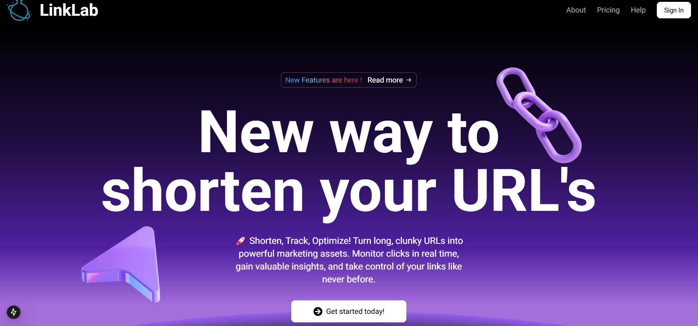
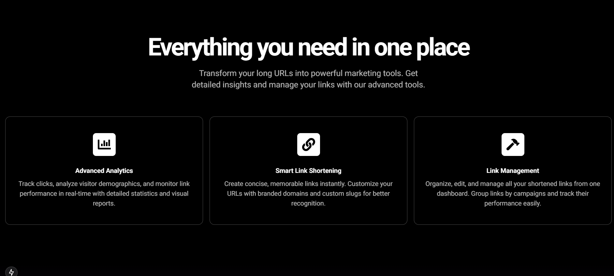
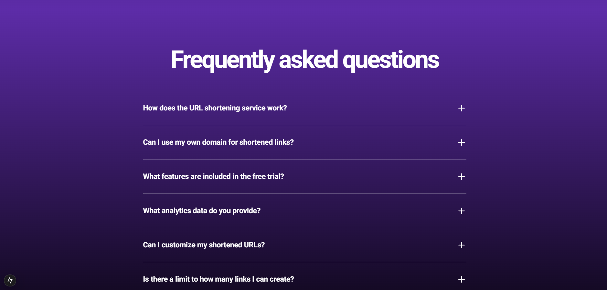
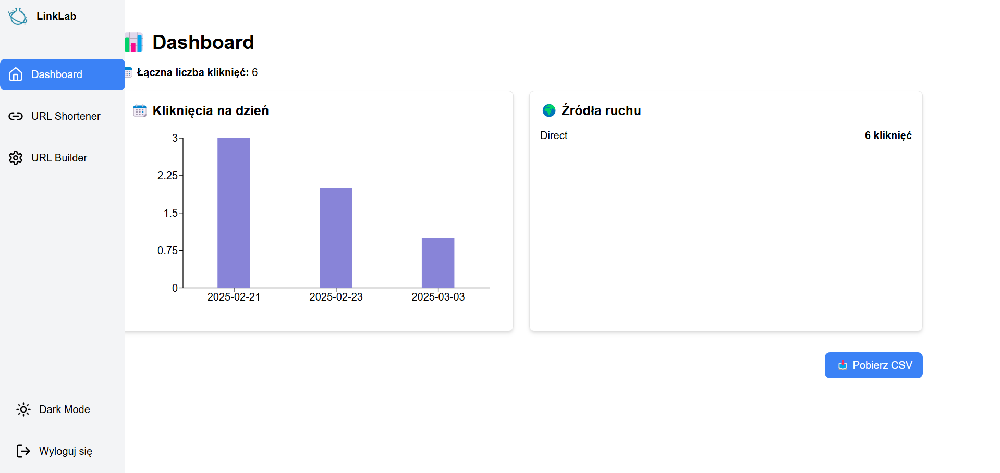
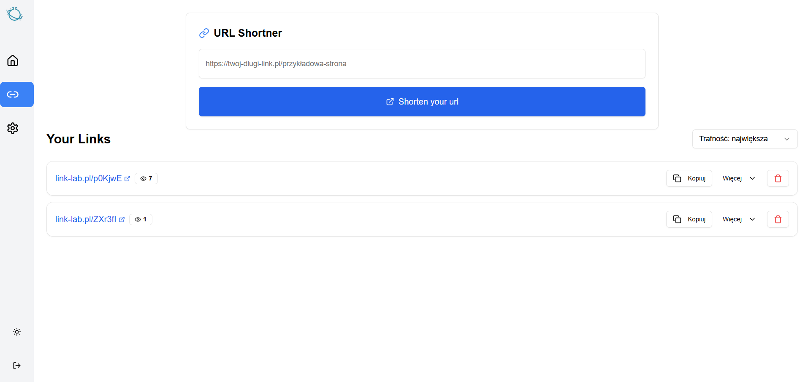
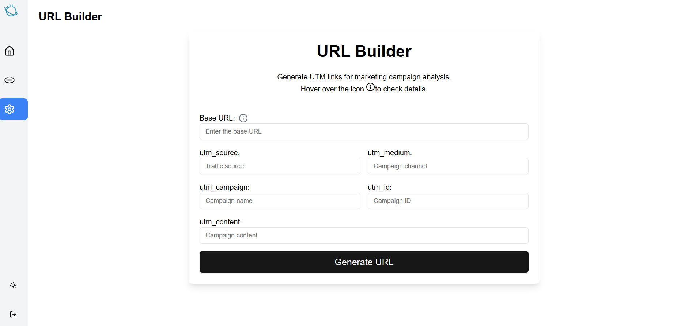

# 🚀 LinkLab - URL Shortener & Analytics

This is a [Next.js](https://nextjs.org) project that allows you to shorten URLs, track clicks, and analyze traffic data efficiently.
# Url to visit the App : https://link-lab-one.vercel.app/

## 📸 Screenshots

### 🏡 Landing Page


### 🛠️ Features  


### ❓ FAQ Section  


### 📊 Dashboard - Click Statistics


### 🔗 URL Shortener & Link Management  


### 🔗 URL Builder


## 🔧 Features
- 🔗 **Shorten Links** – Instantly generate short, trackable URLs.
- 📈 **Advanced Analytics** – Monitor clicks, traffic sources, and trends.
- 🌍 **Custom Domains** – Use your own domain for branded short links.
- 📤 **Export Data** – Download click data in CSV format.
- 🔄 **Automation with n8n** – Automate tasks using n8n workflows.

## 🚀 Getting Started

First, run the development server:

```bash
npm run dev
# or
yarn dev
# or
pnpm dev
# or
bun dev
```
Open http://localhost:3000 with your browser to see the result.

## 🛠️ Technologies Used
- ⚛️ **React.js** – Modern frontend framework
- ⏭️ **Next.js** – Server-side rendering and API routes
- 📦 **Prisma** – ORM for database management
- 📊 **Chart.js & Recharts** – Data visualization
- 📩 **Mailgun API** – Email notifications
- ☁️ **Vercel** – Deployment platform
- 🔗 **Clerk** – Authentication and user management
- 🛠️ **n8n** – Backend automation

## 🚀 Deployment on Vercel
This project is ready for deployment on Vercel. Simply push your code to GitHub and link your repository to Vercel.

## 📚 Learn More
Next.js Documentation – Learn about Next.js features and API.
Learn Next.js – Interactive Next.js tutorial.
Check out the Next.js GitHub repository for feedback and contributions.
